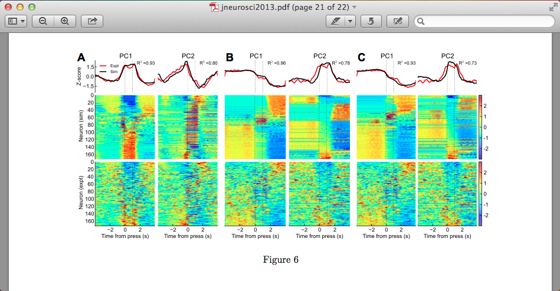

## An efficient workflow for reproducible science


Trevor Bekolay <br>
University of Waterloo <br>
[bekolay.org/scipy2013-workflow](http://bekolay.org/scipy2013-workflow)

<aside class="notes" markdown=1>
* PhD student at the University of Waterloo
* I want to talk about mostly how I am
  currently working such that my science is reproducible.
* No overarching tool, just a set of tips.
  * What I wish I'd known when I started my PhD
</aside>


## Recreatability + openness
## &rArr; reproducibility

<aside class="notes">
* Reproducibility is the goal, but in order to do that
  we first need recreatability
  * Reproducible = read a paper; given that text,
    independently set up and do the experiment.
  * Recreatable = given access to everything that went
    into producing a paper, recreate it.
* Recreatability should be a given, but it's not, it's hard
* Difficulty with recreatability
  is understandable, but inexcusable
* My thought: make your own work recreatable,
  release it in the open, and reproducibility will follow
</aside>


1. Read literature
2. Form hypothesis
3. Try stuff out
4. <span class="fragment highlight-red">Produce a research artifact</span>

<aside class="notes" data-markdown>
* A scientist does a lot of things
  * This talk is focused on this last part,
    producing an artifact to be consumed by others
* We don't talk about this part enough
  * You may completely disagree with me
    * That's great, but provide alternatives
</aside>


## Ideal workflow

1. Recreatable
2. Simple (the fewer tools the better)
3. Fast (able to see the result of changes)

<aside class="notes">
* What does the ideal workflow look like?
* Recreatability is number 1
  * Sometimes comes at the expense of simplicity or speed
  * These three are all in conflict
* How to get all three of these,
  or at least close?
</aside>


```bash
git clone
  https://github.com/tbekolay/jneurosci2013.git
python run.py
  download_data convert plot combine all paper
```



<aside class="notes">
* This is what I've done now
* This isn't just a complicated figure,
  it's a whole 22 page paper with
  multiple complicated figures
* Here's what I learned in getting to that point
</aside>


## 1 project : 1 directory
<div class='tip'>Tip 1</div>

* When you start making an artifact, make a new directory

<aside class="notes">
* People consume your research as the artifact
* Only include what you did to make that artifact
  * There will be some duplication, but so what
* Also means you can put this in version control
  * The sooner the better!
</aside>


## Use `virtualenv`
<div class='tip'>Tip 2</div>
and `virtualenvwrapper`

1. Use `--no-site-packages` (the default now)
2. `cd /project/dir && setvirtualenvproject`
3. `pip install <package>`
4. `pip freeze > requirements.txt`

<aside class="notes">
* Wish I had more time to talk about virtualenv!
  * Trust me: it's worth learning
* Install new packages at a whim
  * When you're done, pip freeze to make a requirements.txt
</aside>


## Make packages from duplicate code
<div class='tip'>Tip 3</div>

* You can never totally get rid of duplicate code
* Consider making (`pip` installable) Python packages

<aside class="notes">
* Give up on having absolutely no duplicate code
  * Kind of nice to see your progress anyhow
* If you repeat a ton, you're doing something novel
  * Put it on PyPI
    * PyPI has a lot of crap on it,
      it'll be fine
</aside>


## Put forgettables<br>in a `README`
<div class='tip'>Tip 4</div>

```markdown
run.py usage
============
download_data -- Downloads data from figshare
convert -- Convert any CSVs in data/ to HDF5

Requirements
============
- libpng (apt-get install libpng-dev)
- python
- pip
- Packages in requirements.txt
```

<aside class="notes">
* README should contain anything you're worried
  about forgetting
  * Write it for yourself
</aside>


## Directory structure
<div class='tip'>Tip 5</div>

<div class='d3' id='workflow-1'></div>

<div class='fragment two-col'>
<ul class='no-bullet'>
<li><span data-icon="&#xe000;"></span> `data`</li>
<li><span data-icon="&#xe000;"></span> `figures`</li>
<li><span data-icon="&#xe000;"></span> `paper`</li>
<li><span data-icon="&#xe000;"></span> `plots`</li>
</ul><ul class='no-bullet'>
<li><span data-icon="&#xe000;"></span> `scripts`</li>
<li><span data-icon="&#xe002;"></span> `requirements.txt`</li>
<li><span data-icon="&#xe001;"></span> `run.py`</li>
<li><span data-icon="&#xe002;"></span> `README`</li>
</div>

<aside class="notes">
* This is (roughly) how a paper gets made
* Our directory structure should reflect this
  * Subdirectories should be clear
</aside>


## Decouple analysis
<div class='tip'>Tip 6</div>

<div class='d3' id='workflow-2'></div>

<aside class="notes">
* Think of analysis as compression
  * Going from big raw data to small important data
* If an analysis needs information from two
  sources, it's a meta-analysis
</aside>


## Do everything with `run.py`
<div class='tip'>Tip 7</div>

* Like a makefile for your artifact
* Force yourself to put everything in here
  * `subprocess` is your friend

<aside class="notes">
* run.py contains the logic to do everything
  * I mean everything!!
* Force yourself to put everything in there
  * Easy to forget what terminal command you used
    when you need to do paper revisions
</aside>


```python
from scripts import analysis, plots, figures
if __name__ == '__main__':

    # Analysis
    results = {}
    for path in glob('data/*'):
        results[path] = analysis.analyze(path)

    # Meta-analysis
    meta_result = analysis.meta_analyze(results)

```

<aside class="notes">
* Skeleton example
  * scripts/ has analysis.py, plots.py, figures.py
</aside>


```python
    # Plots
    plot_files = {}
    for path in results:
        result = results[path]
        plot_files[path] = plots.make_plot(result)

    meta_plot = plots.make_meta_plot(meta_result)

    # Figures
    plot_file = plot_files.values()[0]
    figures.make_figure(plot_file, meta_plot)

```


## Use command line arguments
<div class='tip'>Tip 8</div>

<aside class="notes">
* run.py is all you should interact with
  * Make command line arguments
    for the various things you do with it
</aside>


Bad!

```python
    SAVE_PLOTS = True
    ...
    plot(data, save=SAVE_PLOTS)
```

```bash
> python run.py
> emacs run.py
# Change SAVE_PLOTS
> python run.py
```

<aside class="notes">
* This was something I used to do a lot
  * Every time you open up an editor,
    you're expending mental energy
</aside>


Good!

```python
    SAVE_PLOTS = 'save_plots' in sys.argv
    ...
    plot(data, save=SAVE_PLOTS)
```

```bash
> python run.py
> python run.py save_plots
```

<div class="fragment">Bonus tip: try [docopt](http://docopt.org/) for advanced cases</div>

<aside class="notes">
* Less energy, after you make the argument
* If you need complex stuff, try docopt
</aside>


## Parallelize & cache
<div class='tip'>Tip 9</div>

* Profile first!

<aside class="notes">
* You may not actually have expensive steps
  * But if you do, you can speed them up easily
</aside>


```python
    # Analysis
    results = {}
    for path in glob('data/*'):
        results[path] = analysis.analyze(path)
```

<aside class="notes">
* Here's our analysis snippet from before
</aside>


```bash
> ipcluster start -n 5
```

```python
    from IPython import parallel

    rc = parallel.Client()
    lview = rc.load_balanced_view()

    results = {}
    for path in glob('data/*'):
        asyncresult = lview.apply(analyze, path)
        results[path] = asyncresult

    for path, asyncresult in results.iteritems():
        results[path] = asyncresult.get()
```

<aside class="notes">
* In just a handful of extra lines,
  this is now done in parallel (with IPython.parallel)
</aside>


```python
    # Plots
    plot_files = {}
    for path in results:
        result = results[path]
        plot_files[path] = plots.make_plot(result)
```

<aside class="notes">
* Here's our plot snippet from before
</aside>


```python
    plot_files = {}
    for path in results:
        # data/file1.h5 => plots/file1.svg
        plot_path = 'plots/' + os.path.splitext(
            os.path.basename(path))[0] + ".svg"

        if os.exists(plot_path):
            plot_files[path] = plot_path
        else:
            res = results[path]
            plot_files[path] = plots.make_plot(res)
```

<div class="fragment">
Bonus tip: release cached analysis data <br>
if raw data is confidential
</div>

<aside class="notes">
* Now we're not reduplicating that effort
* You may be able to release cached analyses
  even if raw data is confidential
</aside>


## Put it all online
<div class='tip'>Tip 10</div>

* Let [Github](http://www.github.org/) or
  [Bitbucket](http://www.bitbucket.org/) handle web stuff
  * Papers should be changeable and forkable anyway
* Store source and artifacts separately
  * Try [fig**share**](http://figshare.com/)
    or [Dryad](http://datadryad.org/)

<aside class="notes">
* Online repositories are more reliable
  than your computer
  * Can have this private,
    but please consider making it public
</aside>


[<span data-icon="&#xe003;"></span> tbekolay/jneurosci2013](https://github.com/tbekolay/jneurosci2013) • [data (fig**share**)](http://figshare.com/articles/Adaptive_control_of_action_Simulation_results/715887)

----

<div class='two-col'>
<ol>
<li>[1:1 projects:directories](#/7)</li>
<li>[Use `virtualenv`](#/8)</li>
<li>[Put good stuff on PyPI](#/9)</li>
<li>[Write a `README`](#/10)</li>
<li>[Directory structure](#/11)</li>
</ol><ol start="6">
<li>[Decouple analysis](#/12)</li>
<li>[Write a `run.py`](#/13)</li>
<li>[Command line args](#/14)</li>
<li>[Parallelize & cache](#/15)</li>
<li>[Upload code/data](#/16)</li>
</ol>
</div>

----

[bekolay.org/scipy2013-workflow](http://bekolay.org/scipy2013-workflow) • [tbekolay@gmail.com](mailto:tbekolay@gmail.com)

<aside class="notes">
* I hope these tips were helpful!
  * My JNeuroscience paper and this presentation
    are both on Github
    * Please suggest improvements!
</aside>
