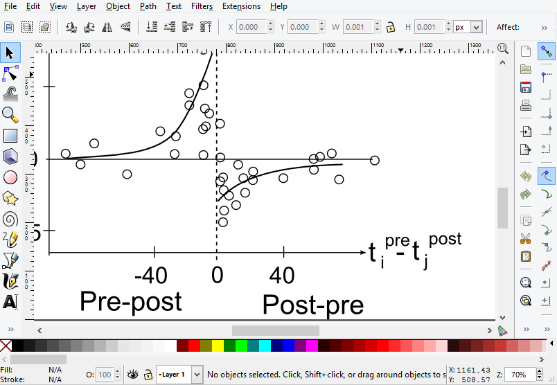

## An efficient workflow for reproducible science


Trevor Bekolay <br>
University of Waterloo

<aside class="notes" markdown=1>
Hi, I'm Trevor Bekolay and I'm a PhD
student at the University of Waterloo
working in computational neuroscience.

Today I want to share with you
some ideas about how you can
do science in a more reproducible way.
I'm not presenting any particular tool
here today; this talk is more a collection
of tips -- it's what I wish I had known
when I started my PhD.
</aside>


## An efficient workflow for <del>reproducible</del> <ins>recreatable</ins> science


Trevor Bekolay <br>
University of Waterloo

<aside class="notes">
I should say that really my title is not precisely correct.
While the goal is to be able to
have people read your paper
and then independently reproduce those results,
what I'm talking about today is more
about recreatability --
can you yourself reproduce your results,
can you take your data and recreate the figures
published in your paper?

As I'm sure many of you know,
this is not necessarily a simple task.
There are lots of reasons why this is hard,
so it is understandable that recreatability is hard,
but that doesn't make it excusable.
If you yourself can't recreate the figures
in your paper, then how can you expect
anyone else to be able to?
</aside>


## Science, sort of

<div class='d3' id='workflow-1'></div>

<aside class="notes">
Let's talk a bit about the practice of science.
This is a very pragmatic view of things,
but in that pragmatic sense, you start
with a hypothesis, from that you design
an experiment -- whether it be real of simulated --
which produces data.
You plot that data, assemble it into a figure,
and slap some text around it and you've got a paper.
Which is of course all that matters, right?

Of course, this is a simple diagram, and it's missing
a lot -- notably, science is not a feedforward process,
it's really a cycle, and there should be an arrow
going back from plots to hypothesis.
But, let's just assume a simple feedforward process
for the purposes of this talk.

Given that, I'm sure you'll agree that there is
a huge amount that goes into
the experiment/simulation boxes here.
But, each experiment is different,
so there isn't much detail we can provide here.
Indeed, it is mostly the role of the publication system
to discuss the left side of this graph.

But there is a lot that goes into the right side
here too. And this is often not well explained
in papers.
</aside>


## My first plot

```python
import matplotlib.pyplot as plt
def plot_for_paper(path):
    with open(path) as f:
        for line in f:
            # put data in data structures
    # do analysis on those data structures
    plt.plot(results)
```

<aside class="notes">
So, when I started my masters degree,
I created plotting functions like this one.
I'd save my data in some file,
pass the filename to a function like this,
parse and analyze that file,
and then plot the results.
Seems good; I can pass in different filenames
and produce the same plot,
if I've done this function right.
And as I get more complicated things
going on, I'd add more arguments to this function, and so on.
And this is okay, I essentially did
this for my masters degree without much of a problem.
Just to get a sense of things,
how many people write plotting functions like this?
</aside>


## My first figure



<aside class="notes">
Then, after making my wonderful plot,
I would save it as an SVG,
import them into Inkscape
and add extra things like annotations
and things that I just didn't know how to do
with Matplotlib.
I wasn't very happy with it,
as it was a lot of manual effort,
but it was still a vector image
that I could easily put in a LaTeX
document, so it did the job.

And this worked out fine for
my whole masters degree, essentially.
But, when I started my PhD, I spent four months
at an experimental lab working with real world data.
I started writing plotting functions
the same way as before,
hit go, and waited for an hour
before the first plot to finish.
Clearly this wouldn't cut it.
</aside>


<ol>
<li>Duplicating a lot of code</li>
<li class="fragment">Duplicating a lot of work</li>
<li class="fragment">Not documenting manual steps</li>
</ol>

<aside class="notes">
It wouldn't cut it because I was
redoing a lot of work;
when you're handling a 1GB file,
you don't want to be parsing it multiple times.
I was duplicating a lot of code;
there's a big disincentive to optimizing
analysis code when you have manually
change every instance where you do that analysis.
And there were these manual steps
that I wasn't properly documenting.
Really, for the amount of effort that would
go into documenting those manual processes,
I might as well find a way to automate it.

The key thing, that is perhaps obvious
to experimentalists -- or everyone but me --
is that analysis, plotting, and figure generation
are all separate steps.
</aside>


<div class='d3' id='workflow-2'></div>

<aside class="notes">
This shows how I think of the scientific workflow.
Each data file has some kind of analysis done on it,
which essentially pulls out the important information
from the data, taking a huge data file
and hopefully extracting a smaller amount of data
that we're actually going to plot.
Then, if we need to do some analysis that
requires data from multiple files,
we instead do that meta-analysis
on the results of the original analysis,
and use both of those to do the actual
plotting. One or more plots
get composed together into a figure,
which is put into the paper.

When we think of them as separate steps,
then it's easy to see opportunities for speedups.
As you may know, there are really only two
reliable speedups in computer science:
parallelization and caching.
There are clear opportunities for that here:
each data file's analysis can be parallelized
because each file is independent.
Each plotting function can be parallelized
because it's just plotting the results
of analyses -- and the results of an analysis
should be much smaller than the data files
themselves, meaning it's not too expensive
to make copies for plotting.
We can cache the results of these analyses
when we're prefecting our plot functions,
and cache the plots themselves when figuring
out how to best compose them into figures.
That composing step should be part of this
diagram so that we make sure we do this
in a way that can be recreated.
</aside>


### Let's build a tool!

<aside class="notes">
I think this is the point where
a lot of grad students with perhaps too
much time on their hands
set out to build a tool to do all of this.
And in many domains this makes sense,
and I don't want to diminish the efforts
of the really impressive tools that exist,
and that are likely to be presented at SciPy.
But different domains have different demands;
in neuroscience, for example,
we have data in weird file formats
that need specific tools to load.
Other domains will need more sophisticated
3D plotting functions than are available
in Matplotlib, for example.
So to make a tool that prescribes any step
in this pipeline is doomed to failure,
and when you start doing hardcore analysis,
you'll find a lot of tools that tried
to do this and end up being used
by a single lab or even a single person,
and inevitably is undertested and unmaintained.
</aside>


### Let's <ins>not</ins> build a tool.

* Use the best domain-specific tools available


# 10 tips

* Assuming Python, but most are general

<aside class="notes">
So let's not build a tool.
Let's let scientists learn the tools
that are most useful for their domain,
and instead give a set of guidelines or tips
for how to organize their use of those tools.

By the way, letting people use domain-specific
tools means that some elements of this
pipeline might not be in Python.
But, Python is a great glue language,
so even if you're externally calling
other programs, I think that
the Python-specific parts of this talk
are relevant.
</aside>


## 1 project : 1 directory
<div class='tip'>Tip 1</div>

* When you start a new project, make a new directory

<aside class="notes">
First, every project -- so,
a paper, or a presentation, or some rough
work that you think might turn
into one of these things --
should reside in its own directory.
The main reason for this is because
it's how people are going to see your work.
They want to know how you did this specific
thing, they don't want to feel like
they have to learn everything you've
ever done to figure out how this one
research output came to be.

Another advantage of this is that
when you finish your project --
or I should say, publish your project --
you can take this directory as is
and put it in a source code repository,
like Github or Bitbucket.
</aside>


## Directory structure
<div class='tip'>Tip 2</div>

<div class='two-col'>
<ul class='no-bullet'>
<li><span data-icon="&#xe000;"></span> `data`</li>
<li><span data-icon="&#xe000;"></span> `figures`</li>
<li><span data-icon="&#xe000;"></span> `paper`</li>
<li><span data-icon="&#xe000;"></span> `plots`</li>
</ul><ul class='no-bullet'>
<li><span data-icon="&#xe000;"></span> `scripts`</li>
<li><span data-icon="&#xe002;"></span> `requirements.txt`</li>
<li><span data-icon="&#xe001;"></span> `run.py`</li>
<li><span data-icon="&#xe002;"></span> `README`</li>
</div>

<aside class="notes">
When you make your project's directory,
consider this directory structure.
It won't work for every project in the world,
but probably 95% of them it'll work just fine.
If all projects had something at least somewhat
like this, it would be much easier for humans
to find what they're looking for,
but also for computers to
index research outputs.
</aside>


## Use `virtualenv`
<div class='tip'>Tip 3</div>

1. Use `--no-site-packages` (the default now)
2. `pip install <package>`
3. `pip freeze > requirements.txt`

<aside class="notes">
Okay, so now some tips about the actual contents.
The first is that most projects should also
have an associated virtual environment.
If you don't know about virtualenv,
do yourself a favor and learn it
because it is indispensable if you want
to do reproducible research.
Make sure when you're the no site packages
flag, which is now the default.
This means that you'll have to reinstall numpy
for every new project, but it's worth it
for the cognitive benefits of
knowing exactly what your project's dependencies are.
Inside your virtual environment,
pip install everything that you need,
and uninstall it if you find you don't need it.
But, including or not including a dependency
shouldn't be on your mind as you do exploratory research.
Then, when you're actually ready to release your project,
put the results of pip freeze into requirements.txt.
</aside>


## Put forgettables<br>in `README`
<div class='tip'>Tip 4</div>

```markdown
To generate figures, run python run.py figures

Requirements
============
  - libpng (apt-get install libpng-dev)
  - python
  - pip

Then run pip install requirements.txt
(preferably in a virtualenv).
```


Copy in README, put link


## Make packages from duplicate code
<div class='tip'>Tip 5</div>

* You can never totally get rid of duplicate code
* Consider making (`pip` installable) Python packages

<aside class="notes"
In the ideal case, each project folder that you create
would share very little code with your other project folders.
Of course, that's nearly impossible to actually achieve,
and some duplication is fine.
But if you are copying significant sections
of code from repository to repository,
then perhaps it's general enough
to consider making into a package
that's worth putting on PyPI.
I can assure you, there are a lot of packages
on PyPI that are worse than what you're putting
out there!
</aside>


## Do everything with `run.py`
<div class='tip'>Tip 6</div>

* Like a makefile for your project
* Implement the [flowchart](#/6)

<aside class="notes">
So, if you just have this directory structure,
you're already doing great.
To take it to the next level,
you should write a little glue program.
Call it whatever you want, I call mine run.py.
The idea is to encapsulate in this file
all of the things that you normally
do in the terminal and then forget about
when you go back to do paper revisions.
</aside>


```python
from scripts import analysis, plots, figures
if __name__ == '__main__':

    # Analysis
    results = {}
    for path in glob('data/*'):
        results[path] = analysis.analyze(path)

    # Meta-analysis
    meta_result = analysis.meta_analyze(results)

```

<aside class="notes">
So, as a minimal example, your run.py
might get all the files in your data directory
and analyze them separately.
Then do a meta-analysis.
</aside>


```python
    # Plots
    plot_files = {}
    for path in results:
        result = results[path]
        plot_files[path] = plots.make_plot(result)

    meta_plot = plots.make_meta_plot(meta_result)

    # Figures
    plot_file = plot_files.values()[0]
    figures.make_figure(plot_file, meta_plot)

```

<aside class="notes">
Then you make a plot for each of the individual
analyses. Then, a plot for the meta-analysis,
and finally you make a figure with
one plot and the meta plot.

Maybe this seems simple and obvious,
but in fact this file is easy to write,
easy to modify, and memorable.
It forces you to separate all of these
steps, and allows you to use
the right tools for each step.
This make_plot function could
use RPy to make a plot with R, for example.
</aside>


## Use command line arguments
<div class='tip'>Tip 7</div>

<aside class="notes">
Now, you've got this run.py file.
But of course, you don't always want to go through
your entire analysis pipeline;
sometimes you want to just check things
or debug things, or whatever.
Whenever you come across some use case for run.py,
make it accessible through some command line
argument.
</aside>


Bad!

```python
    # Config
    SAVE_PLOTS = True

    plot(data, save=SAVE_PLOTS)
```

```bash
> python run.py
> emacs run.py
# Change SAVE_PLOTS
> python run.py
```

<aside class="notes">
So here's what I used to do quite a lot.
I'd have these config options at the top
of run.py, and when I needed to change them,
I'd fire up my editor, change the value,
and run it again. Not the worst,
but when you're at the end of a long work day,
just the thought of firing up your editor
is nauseating.
</aside>


Good!

```python
    # Config
    SAVE_PLOTS = 'save_plots' in sys.argv

    plot(data, save=SAVE_PLOTS)
```

```bash
> python run.py
> python run.py save_plots
```

<div class="fragment">Bonus tip: try [docopt](http://docopt.org/) for advanced cases</div>

<aside class="notes">
Instead, make it a command line argument.
In the simplest case, you can just accept a bunch of possible
strings and change behavior based on their existence.
This works for the vast majority of what you want to do.
If you need something more complicated,
I would really encourage you to check out docopt
rather than learning Python's
argparse or optparse libraries.
</aside>


## Parallelize expensive steps
<div class='tip'>Tip 8</div>

<aside class="notes">
As always, profile your code first
and figure out the bottlenecks
before optimizing.
But when you find them,
do those things in parallel.
</aside>


```python
    # Analysis
    results = {}
    for path in glob('data/*'):
        results[path] = analysis.analyze(path)
```

<aside class="notes">
Let's say that our analysis step is expensive.
Remember that we had this analyze function
which took in the name of a file and
returned some object that represents
the result of the analysis.
This for loop is ripe for parallelization.
</aside>


```bash
> ipcluster start -n 5
```

```python
    from IPython import parallel

    rc = parallel.Client()
    lview = rc.load_balanced_view()

    results = {}
    for path in glob('data/*'):
        asyncresult = lview.apply(analyze, path)
        results[path] = asyncresult

    for path, asyncresult in results.iteritems():
        results[path] = asyncresult.get()
```

<aside class="notes">
In this example, I'm using IPython's parallel
module to do these analyses in parallel,
but you could just as easily use
Python's multiprocessing module,
or whatever tool you already know.
This does exactly what the 3-line example before did,
but now in parallel across 4 CPU cores.
For an extra five or so lines of code,
you've sped up your research more
than almost any amount of complicated
analysis optimizations.
</aside>


## Cache expensive steps
<div class='tip'>Tip 9</div>

<aside class="notes">
The only thing faster than doing a bunch of stuff
in parallel is to not do any stuff at all.
We can easily cache the results of these steps.
Maybe that means you add a cache folder
to your directory and put the results
of analyses there.
</aside>


```python
    # Plots
    plot_files = {}
    for path in results:
        # data/file1.h5 => plots/file1.svg
        plot_path = 'plots/' + os.path.splitext(
            os.path.basename(path))[0] + ".svg"

        if os.exists(plot_path):
            plot_files[path] = plot_path
        else:
            res = results[path]
            plot_files[path] = plots.make_plot(res)
```

<div class="fragment">
Bonus tip: release cached analysis data <br>
if raw data is confidential
</div>

<aside class="notes">
Or, like in this example, we can
only produce plots that don't exist.
If the file that would be produced by the plotting function
already exists, we just use that plot instead.

And as a bonus tip,
if you're involved in a collaboration,
or for some other reason can't release the raw data,
it may be possible to at least release the
cached analysis data -- but also include
the analysis code that was executed.
This is a critical thing that is often lost in the fray!
</aside>


## Put it all online
<div class='tip'>Tip 10</div>

* Let [Github](http://www.github.org/) or
  [Bitbucket](http://www.bitbucket.org/) handle web stuff
  * Papers should be changeable and forkable anyway
* Store source and artifacts separately
  * Try [fig**share**](http://figshare.com/)
    or [Dryad](http://datadryad.org/)

<aside class="notes">
Finally, you refine your plots and figures
and submit your paper.
Once you do that,
put this directory online immediately!
Your hard drive might crash,
but I doubt Github's or Bitbucket will lose your data.
Put it on both if you're paranoid.
This has the added bonus that people
can fork and issue pull requests
on your paper.
Which is what we should be striving for anyway.
Of course, a source code repository like git
isn't appropriate for massive data files
or the generated paper.
I especially like to put raw data
in figshare, which will permanently
store unlimited data if you make it publicly available.
</aside>


## Proof of concept

<div class="d3" id="workflow-2-copy"></div><div class="d3" id="workflow-3"></div>[<span data-icon="&#xe003;"></span> tbekolay/jneurosci2013](https://github.com/tbekolay/jneurosci2013) | [data (fig**share**)](http://figshare.com/articles/Adaptive_control_of_action_Simulation_results/715887)

<aside class="notes">
So, I do actually practice what I'm preaching here today.
That project that I mentioned using real life data,
is now a paper currently under review at the
Journal of Neuroscience.
These are all the tools that I used;
each one is the best tool for the job,
and I didn't have to learn any new all-encompassing analysis pipeline
</aside>


<div class='two-col'>
<ol>
<li>[1:1 projects:directories](#/10)</li>
<li>[Directory structure](#/11)</li>
<li>[Use `virtualenv`](#/12)</li>
<li>[Write a `README`](#/13)</li>
<li>[Put good stuff on PyPI](#/14)</li>
</ol><ol start="6">
<li>[Write a `run.py`](#/15)</li>
<li>[Command line args](#/16)</li>
<li>[Parallelize](#/17)</li>
<li>[Cache](#/18)</li>
<li>[Upload code/data](#/19)</li>
</ol>
</div>

----

[slides] | [<span data-icon="&#xe003;"></span> tbekolay](https://github.com/tbekolay) | [tbekolay@gmail.com](mailto:tbekolay@gmail.com)
